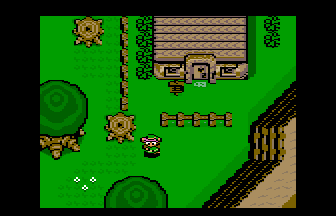

### Description

Jouez l'écran titre de alttp sur votre Thomson et parcourez Lost Woods.

Aucune mécanique de jeu n'est implémentée, il s'agit uniquement de démontrer l'affichage d'une map et les capacités de scrolling du moteur de jeu wide-dot.

L'affichage des triangles dans l'introduction est réalisé en dessinant uniquement la différence entre chaque image et en utilisant une technique de changement de palette de couleur.

    
    

