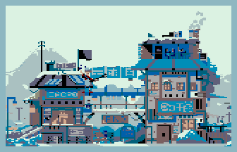

### Description

Démonstration d'un décor animé en image compilée.

    

L'animation du décor est traitée en pre-processing pour déduire uniquement les écarts entre chaque image.

Le fond est sauvegardé au fur et a mesure de l'affichage du sprite, c'est à dire durant l'exécution de la routine de sprite compilé.

L'effacement du sprite se fait également via une routine spécifique à chaque sprite qui charge par pul les registres avec la destination mémoire et les couleurs du fond a restituer.

Driver son utilisé : PSGLIB pour 6809 (wide-dot)

---

Graphics by [faxdoc](https://www.deviantart.com/faxdoc/art/Cacao-and-coffee-shop-580036274) & [Adam Szczęsny](https://dribbble.com/shots/11212994-Kubo-pixel-art-animation)